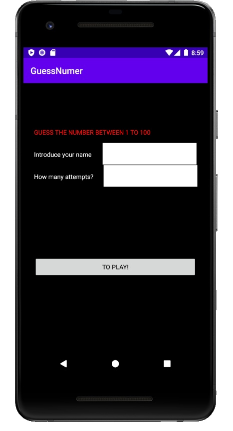

# Ejercicio GuessNumer
<code>Esto es un ejemplo de código</code>
He creado un app para adivinar un numero entre 1 y el 100.
* Software a instalar
* Android Debug Bridge
* Estructura de un proyecto
* Recurso de un proyecto
* Fichero de configuración de grade
* Añadir librerias
* Comentarios
* Entorno de Android Studio
* Depura en Android Studio
* Publicar en la plataforma Github 

Imagen de la primera <code>Activity</code>de mi aplicación:

